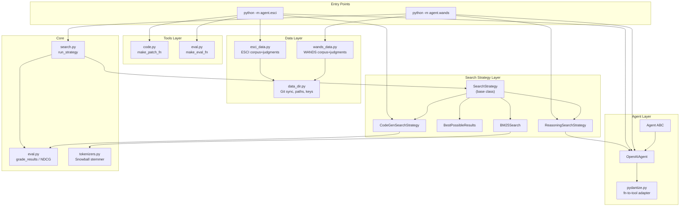
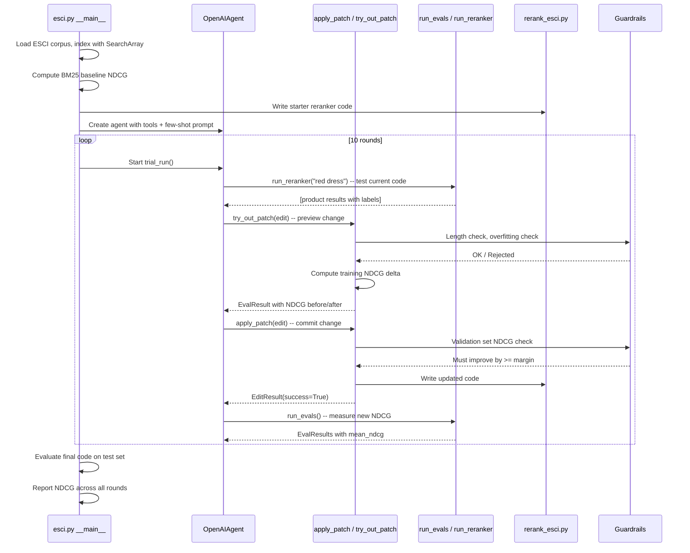

# Comprehensive Analysis of the `cheat-at-search` Library

> **Author of the library**: Doug Turnbull ([blog post](https://softwaredoug.com/blog/2025/10/06/how-much-does-reasoning-improve-search-quality))
>
> **Core question**: Can LLM reasoning improve search relevance beyond traditional BM25 keyword search?

---

## Table of Contents

1. [Phase 1 -- High-Level Overview (Search Functionality)](#phase-1----high-level-overview)
2. [Phase 2 -- Architecture Analysis](#phase-2----architecture-analysis)
3. [Phase 3 -- Detailed Component Analysis](#phase-3----detailed-component-analysis)
4. [Phase 4 -- Python Pattern Explanations](#phase-4----python-pattern-explanations)

---

## Phase 1 -- High-Level Overview

### What Problem Does This Library Solve?

When a user types "red dress" into an e-commerce search box, a traditional keyword search engine (BM25) scores documents based on term frequency and document length. It has no idea that "scarlet gown" is relevant, or that the user probably wants clothing (not a red-painted dresser). The gap between what BM25 returns and what a human would consider ideal is the **relevance gap**.

This library is an experimental framework for measuring and closing that relevance gap using Large Language Models. It asks: if you give an LLM access to a search tool and ask it to find the best results, does it do better than BM25? And if you let an LLM *write reranking code*, can it improve search quality iteratively?

### Two Experimental Approaches

#### Approach 1: Agent-as-Searcher (WANDS dataset)

An OpenAI agent is given a `search_products` tool that performs BM25 keyword search over the Wayfair WANDS furniture catalog. The agent receives a user query (e.g., "modern coffee table"), calls the search tool (potentially multiple times with different keywords, categories, or strategies), evaluates the results, and returns a ranked list of 10 products.

Running it looks like:

```bash
$ poetry run python -m cheat_at_search.agent.wands search_few_shot
```

The agent can be augmented with additional tools:
- **Query history** (`save_queries`, `get_past_queries`): the agent remembers which tool calls worked well for similar queries in past iterations
- **Human judgments** (`get_human_judgments`): the agent can peek at a sample of human relevance labels to calibrate its understanding of what "relevant" means for a given query
- **Few-shot examples**: labeled query-product pairs are included in the system prompt so the agent learns the evaluation criteria

#### Approach 2: Agent-as-Code-Writer (ESCI dataset)

Instead of searching directly, an OpenAI agent writes and iteratively improves a Python reranker function. The function `rerank_esci(search_esci, query)` takes a search tool and a query string, calls the search tool, and returns a reordered list of product IDs.

The agent starts with a trivial reranker:

```python
def rerank_esci(search_esci, query):
    docs = search_esci(keywords=query, field_to_search='product_name',
                       operator='bm25_and', locale='us', top_k=10)
    return [doc['id'] for doc in docs]
```

Then it iteratively improves it by:
1. Calling `run_reranker` to test with specific queries
2. Calling `try_out_patch` to preview NDCG impact of a proposed code change
3. Calling `apply_patch` to commit the change (if it passes validation guardrails)
4. Calling `run_evals` to measure overall NDCG

Running it:

```bash
$ poetry run python -m cheat_at_search.agent.esci
```

The system runs 10 rounds, each round giving the agent fresh training queries and accumulating "lessons learned" across rounds.

### Datasets Supported

| Dataset | Domain | Source | Relevance Scale |
|---------|--------|--------|----------------|
| **WANDS** | Wayfair furniture | [GitHub](https://github.com/wayfair/WANDS) | Exact (2), Partial (1), Irrelevant (0) |
| **ESCI** | Amazon products | [GitHub](https://github.com/softwaredoug/esci-data) | Exact (3), Substitute (2), Complement (1), Irrelevant (0) |
| **TMDB** | Movies | [GitHub](https://github.com/ai-powered-search/tmdb.git) | Numeric grades |
| **MSMARCO** | Web passages | Microsoft | Binary relevance |

Each dataset provides three things: a **corpus** (the documents), **queries** (user search terms), and **judgments** (human labels mapping query-document pairs to relevance grades).

### How Quality Is Measured

The library uses **NDCG@10** (Normalized Discounted Cumulative Gain at rank 10), the standard metric for evaluating ranked search results. In simple terms:

- Each result at position `k` gets a "discount" -- results lower in the ranking matter less
- Each result's relevance grade is converted to a "gain" using `(2^grade) - 1`
- The discounted gains are summed and divided by the ideal DCG (what you'd get with a perfect ranking)
- NDCG = 1.0 means perfect ranking; NDCG = 0.0 means nothing relevant was returned

The library computes this via `eval.py`:

```python
def grade_results(judgments, search_results, max_grade=None, k=10):
    # Merge search results with human judgments to get grades
    graded_results = search_results.merge(
        judgments[['query_id', 'query', 'doc_id', 'grade']],
        on=['query_id', 'query', 'doc_id'], how='left')
    graded_results['grade'] = graded_results['grade'].fillna(0)
    # Apply log-based position discount
    rank_discounts = 1 / np.log2(2 ** graded_results['rank'])
    graded_results['discounted_gain'] = ((2 ** graded_results['grade']) - 1) * rank_discounts
    graded_results['idcg'] = idcg_max(max_grade=max_grade, k=k)
    return graded_results
```

---

## Phase 2 -- Architecture Analysis

### Package Structure

```
cheat_at_search/
├── __init__.py                  # Empty -- package marker
│
├── # --- Core ---
├── eval.py                      # NDCG computation (grade_results, idcg_max)
├── search.py                    # Experiment runner (run_strategy, vs_ideal)
├── tokenizers.py                # Snowball stemming, ASCII folding
├── logger.py                    # Logging configuration
├── cache.py                     # Persistent LRU cache decorator
├── data_dir.py                  # Data path management, git repo syncing, API keys
│
├── # --- Data Layer ---
├── wands_data.py                # WANDS dataset loader (lazy)
├── esci_data.py                 # ESCI dataset loader (lazy)
├── tmdb_data.py                 # TMDB dataset loader (lazy)
├── msmarco_data.py              # MSMARCO dataset loader (lazy)
├── start_rerank_esci.py         # Starter reranker code (seed for agent)
│
├── # --- Search Strategy Layer ---
├── strategy/
│   ├── __init__.py              # Exports BM25Search, BestPossibleResults, SearchStrategy
│   ├── strategy.py              # SearchStrategy base class (threaded search_all)
│   ├── bm25.py                  # BM25Search implementation via SearchArray
│   └── best.py                  # BestPossibleResults (oracle using judgments)
│
├── # --- Model Layer ---
├── model/
│   ├── __init__.py              # Exports all model classes
│   ├── product.py               # Product, EnrichedProduct, ProductCategory, ItemType
│   ├── query.py                 # Query, StructuredQuery, QueryWithSynonyms, QueryCategory
│   └── category_list.py         # Categories, SubCategories as Literal types
│
├── # --- Agent Layer ---
├── agent/
│   ├── openai_agent.py          # OpenAIAgent -- tool-calling loop over OpenAI API
│   ├── search_client.py         # Agent ABC, SearchResult/SearchResults Pydantic models
│   ├── pydantize.py             # Converts Python functions -> OpenAI tool specs
│   ├── strategy.py              # ReasoningSearchStrategy -- agent-powered search
│   ├── wands.py                 # WANDS experiment runner (agent-as-searcher)
│   ├── esci.py                  # ESCI experiment runner (agent-as-code-writer)
│   ├── esci_old.py              # Earlier version of ESCI experiment
│   ├── history.py               # Search interaction memory (embedding-based recall)
│   └── judgments.py             # Human judgment tool factory
│
├── # --- Tools Layer ---
├── tools/
│   ├── code.py                  # Code patching, guardrails, backup/revert
│   └── eval.py                  # CodeGenSearchStrategy, eval/reranker factories
│
└── # --- Enrichment Layer ---
    enrich/
    ├── __init__.py              # Exports AutoEnricher, ProductEnricher, etc.
    ├── enrich.py                # AutoEnricher, ProductEnricher orchestrators
    ├── enrich_client.py         # EnrichClient ABC, DebugMetaData
    ├── cached_enrich_client.py  # MD5-keyed JSON cache with periodic saves
    ├── openai_enrich_client.py  # OpenAI structured output enrichment
    ├── google_enrich_client.py  # Google Gemini enrichment
    └── openrouter_enrich_client.py  # OpenRouter multi-model enrichment
```

### Architecture Diagram



### Key Architectural Patterns

#### 1. Strategy Pattern

All search approaches implement the same interface -- `SearchStrategy` -- so `run_strategy()` can evaluate any of them identically:

```python
class SearchStrategy:
    def search(self, query, k=10):
        raise NotImplementedError

    def search_all(self, queries, k=10):
        # Runs search() for each query using ThreadPoolExecutor
        ...
```

Implementations: `BM25Search`, `BestPossibleResults`, `ReasoningSearchStrategy`, `CodeGenSearchStrategy`. This means you can swap a BM25 baseline for an LLM agent with zero changes to the evaluation code.

#### 2. Factory Pattern (Closures)

Functions like `make_patch_fn()` and `make_eval_fn()` return *groups of functions* that share internal state (the corpus, judgments, file paths, guardrail functions). This is the Python closure pattern -- inner functions capturing variables from the enclosing scope:

```python
def make_eval_fn(corpus, judgments, code_dir, search_fn, ...):
    def run_evals() -> EvalResults:
        # Uses corpus, judgments, code_dir from outer scope
        ...
    def run_reranker(query, label=False):
        # Also uses corpus, judgments from outer scope
        ...
    return run_evals, run_reranker
```

#### 3. Lazy Module Loading

Each data module (`wands_data.py`, `esci_data.py`, etc.) uses Python's module-level `__getattr__` to defer expensive loading until the data is actually accessed. This is critical because loading datasets involves cloning Git repos and parsing large CSV/Parquet files.

#### 4. Adapter Pattern

`pydantize.py` bridges the gap between plain Python functions and the OpenAI function-calling API. It inspects a function's signature with `inspect.signature()` and `get_type_hints()`, creates a Pydantic model for the arguments, and generates an OpenAI-compatible tool specification.

---

## Phase 3 -- Detailed Component Analysis

### 3.1 Core: `eval.py` -- NDCG Computation

This is the mathematical heart of the library. It computes how well a set of search results matches human relevance judgments.

**`idcg_max(max_grade, k)`** computes the Ideal DCG -- the maximum possible score if the top `k` results all have the highest grade:

```python
def idcg_max(max_grade=2, k=10):
    rank_discounts = 1 / np.log2(2 ** np.arange(1, k + 1))
    numerator = (2**max_grade) - 1
    gains = rank_discounts * numerator
    return np.sum(gains)
```

For example, with `max_grade=2` and `k=10`, this gives the DCG you'd get if all 10 results had grade 2.

**`grade_results(judgments, search_results, max_grade, k)`** takes search results and human judgments, merges them on `(query_id, doc_id)`, and computes per-result discounted gain. Any document not in the judgments gets grade 0 (irrelevant).

### 3.2 Core: `search.py` -- Experiment Runner

This module orchestrates running a search strategy across queries and computing aggregate metrics.

**`run_strategy(strategy, judgments, queries, num_queries, seed)`** is the main entry point for every experiment:

1. Selects which queries to evaluate (all, a random sample, or a specific list)
2. Calls `strategy.search_all(queries)` to get ranked results
3. Calls `grade_results()` to compute per-result discounted gains
4. Computes per-query DCG and NDCG
5. Returns a DataFrame with columns like `query`, `rank`, `grade`, `dcg`, `ndcg`

Example of how it's used:

```python
bm25 = BM25Search(corpus)
graded_bm25 = run_strategy(bm25, judgments, num_queries=100, seed=42)
print(f"BM25 NDCG: {graded_bm25['ndcg'].mean()}")
```

**`vs_ideal(graded_results, judgments, corpus)`** creates a side-by-side comparison DataFrame showing, for each rank position, what the search returned vs. what the ideal result would have been. Useful for debugging why a particular query performs poorly.

**`ndcg_delta(variant_graded, baseline_graded)`** computes the per-query NDCG difference between two approaches -- handy for seeing which queries improved and which degraded.

### 3.3 Core: `tokenizers.py` -- Text Processing

Three tokenizers, all built on the same foundation of ASCII folding + punctuation removal:

**`snowball_tokenizer(text)`** is the primary tokenizer. It:
1. Translates Unicode quotes/dashes to ASCII equivalents via `str.translate()`
2. Replaces all punctuation with spaces
3. Lowercases the text
4. Stems each token using the Snowball stemmer (via PyStemmer)

```python
>>> snowball_tokenizer("Hello, worlds!")
['hello', 'world']  # "worlds" stemmed to "world"
```

**`taxonomy_tokenizer(text)`** is identical but replaces `/` with `ddd` first, so taxonomy paths like `Furniture/Living Room` don't get split on the slash.

**`ws_tokenizer(text)`** does everything except stemming -- useful when you want exact word matches.

### 3.4 Strategy: `strategy.py` -- Base Class

The `SearchStrategy` base class provides the `search_all()` method that parallelizes search across queries:

```python
class SearchStrategy:
    def __init__(self, corpus, top_k=5, workers=1):
        self.corpus = corpus
        self.workers = workers

    def search_all(self, queries, k=10):
        with ThreadPoolExecutor(max_workers=self.workers) as executor:
            futures = {}
            for _, query_row in queries.iterrows():
                future = executor.submit(self.search, query_row['query'], k)
                futures[future] = query_row
            for future in tqdm(as_completed(futures), ...):
                query_row = futures[future]
                top_k, scores = future.result()
                # Build results DataFrame with rank, score, query_id
                ...
        return pd.concat(all_results)
```

Each subclass only needs to implement `search(query, k)`, which returns `(top_k_indices, scores)` -- a list of corpus row indices and corresponding scores.

### 3.5 Strategy: `bm25.py` -- BM25 Baseline

The BM25 baseline uses `searcharray`, a library for array-based BM25 scoring. On initialization, it indexes the corpus title and description fields:

```python
class BM25Search(SearchStrategy):
    def __init__(self, corpus, title_boost=9.3, description_boost=4.1):
        if 'title_snowball' not in self.index:
            self.index['title_snowball'] = SearchArray.index(
                corpus['title'], snowball_tokenizer)
        if 'description_snowball' not in self.index:
            self.index['description_snowball'] = SearchArray.index(
                corpus['description'], snowball_tokenizer)
```

The `search()` method tokenizes the query, scores each token against both fields with configurable boosts, and returns the top-k by score:

```python
def search(self, query, k=10):
    tokenized = snowball_tokenizer(query)
    bm25_scores = np.zeros(len(self.index))
    for token in tokenized:
        bm25_scores += self.index['title_snowball'].array.score(token) * 9.3
        bm25_scores += self.index['description_snowball'].array.score(token) * 4.1
    top_k = np.argsort(-bm25_scores)[:k]
    return top_k, bm25_scores[top_k]
```

The boosts (9.3 for title, 4.1 for description) reflect that matching in the title is more indicative of relevance than matching in the description.

### 3.6 Strategy: `best.py` -- Oracle Baseline

`BestPossibleResults` uses the human judgments directly to return the highest-graded documents. This represents the ceiling -- the best NDCG achievable given the judgment data:

```python
def search(self, query, k=10):
    query_labels = self.judgments[self.judgments['query'] == query].copy()
    sorted = query_labels.sort_values('grade', ascending=False).head(k)
    # Return corpus indices for these docs
    ...
```

### 3.7 Agent: `openai_agent.py` -- The LLM Tool-Calling Loop

`OpenAIAgent` is the bridge between the library and OpenAI's API. It implements a tool-calling loop:

```
User prompt --> OpenAI API --> Response
                                  |
                         Has tool calls? ---No---> Return parsed output
                                  |
                                 Yes
                                  |
                         Execute tool functions
                                  |
                         Append results to conversation
                                  |
                         Loop back to OpenAI API
```

The `chat()` method implements this loop:

```python
def chat(self, user_prompt=None, inputs=None):
    tool_calls_found = True
    while tool_calls_found:
        resp = self.openai.responses.parse(
            model=self.model,
            input=inputs,
            tools=tools,
            text_format=self.response_model
        )
        inputs += resp.output
        tool_calls_found = False
        for item in resp.output:
            if item.type == "function_call":
                tool_calls_found = True
                # Look up the tool, parse args, call it
                tool = self.search_tools[item.name]
                fn_args = ToolArgsModel.model_validate_json(item.arguments)
                py_resp, json_resp = tool_fn(fn_args)
                # Feed result back to the model
                inputs.append({
                    "type": "function_call_output",
                    "call_id": item.call_id,
                    "output": json_resp,
                })
    return resp, inputs, total_tokens
```

Key details:
- Tools are registered in `__init__` by calling `make_tool_adapter` on each function
- The loop continues until the model stops making tool calls (or hits `max_tokens`)
- `response_model` enables structured output parsing (e.g., `SearchResults`, `FinalMessage`)
- Token usage is tracked across iterations for cost monitoring

### 3.8 Agent: `pydantize.py` -- Function-to-Tool Adapter

This is one of the most clever modules. It takes any Python function and produces three things:
1. A Pydantic model for the function's arguments
2. An OpenAI tool specification (JSON schema)
3. A callable that validates arguments and calls the original function

```python
def make_tool_adapter(func, agent_state_param="agent_state"):
    sig = inspect.signature(func)
    hints = get_type_hints(func)

    # Build Pydantic fields from function parameters
    fields = {}
    for pname, p in sig.parameters.items():
        ann = hints.get(pname, Any)
        default = ... if p.default is inspect._empty else p.default
        fields[pname] = (ann, default)

    # Dynamically create a Pydantic model
    ArgsModel = create_model(f"{func.__name__.capitalize()}Args", **fields)

    # Build OpenAI tool spec from the model's JSON schema
    tool_spec = {
        "type": "function",
        "name": func.__name__,
        "description": func.__doc__.strip(),
        "parameters": ArgsModel.model_json_schema(),
    }
    ...
```

For example, given this function:

```python
def search_products(keywords: str,
                    category: Optional[Categories] = None,
                    top_k: int = 5) -> List[Dict]:
    """Search for furniture products with the given keywords and filters"""
    ...
```

`make_tool_adapter` produces a tool spec like:

```json
{
  "type": "function",
  "name": "search_products",
  "description": "Search for furniture products with the given keywords and filters",
  "parameters": {
    "type": "object",
    "properties": {
      "keywords": {"type": "string"},
      "category": {"enum": ["Furniture", "Kitchen & Tabletop", ...], "type": "string"},
      "top_k": {"type": "integer", "default": 5}
    },
    "required": ["keywords"]
  }
}
```

### 3.9 Agent: `strategy.py` -- ReasoningSearchStrategy

This strategy delegates each search query to an LLM agent. It wraps the agent in the `SearchStrategy` interface so it can be evaluated identically to BM25:

```python
class ReasoningSearchStrategy(SearchStrategy):
    def search(self, query, k=10):
        prompt = self.prompt + f"\nSearch query: {query}"
        search_results, total_tokens = self.search_client.search(
            prompt, return_usage=True)
        # Extract product IDs and scores from structured response
        for result in search_results.results[:k]:
            top_k.append(int(result.id))
            scores.append(result.score)
        return top_k, scores
```

It includes a disk-based cache (pickle) keyed by a hash of the prompt + corpus, so re-running the same experiment doesn't re-invoke the LLM.

### 3.10 Agent: `wands.py` -- WANDS Experiment

This is one of the two main entry points. It orchestrates the "agent-as-searcher" experiment:

1. **Loads data**: enriched WANDS products with SearchArray indexes on title, description, and category
2. **Defines `search_products()`**: a BM25 search function with optional category filtering, exposed as an LLM tool
3. **Defines system prompts**: multiple variants (no judgments, with judgments, few-shot, with/without history)
4. **Runs `agent_search_wands()`**: creates an OpenAI agent with the tools, wraps it in `ReasoningSearchStrategy`, and evaluates via `run_strategy()`
5. **Iterates**: optionally runs multiple iterations, re-indexing query history between iterations so the agent benefits from past interactions

The `__main__` block dispatches to different configurations via command-line arguments:

```python
if sys.argv[-1] == "search_few_shot":
    agent_search_wands(use_old=False,
                       iterations=1, num_queries=100,
                       prompt=build_few_shot_prompt(10, ...),
                       seed=seed)
```

### 3.11 Agent: `esci.py` -- ESCI Experiment (Agent-as-Code-Writer)

This is the second main entry point and the more sophisticated experiment. Its data flow:



**Key concepts in `trial_run()`**:

- **Training set**: queries the agent can see NDCG for (via `try_out_patch`)
- **Validation set**: hidden queries used by `apply_patch` to reject overfitting changes
- **Test set**: completely hidden queries used only at the end to report final NDCG
- **Guardrails**: three layers of protection against bad code:
  1. `make_length_validator` -- rejects edits > 10 lines or > 120 chars wide
  2. `make_guardrail_checker` -- uses an LLM to check if code overfits to specific queries
  3. `make_eval_guardrail` -- rejects if validation NDCG doesn't improve by at least `eval_margin`

### 3.12 Agent: `history.py` -- Search Interaction Memory

This module gives the agent "memory" across queries. When the agent uses a search tool, it records what keywords it used, what category filter, and whether results were good/meh/bad:

```python
class SearchInteraction(BaseModel):
    user_query: str        # "red dress"
    search_tool_name: str  # "search_products"
    search_tool_query: str # "red dress formal"
    search_tool_category: Optional[str]  # "Furniture"
    quality: Literal['good', 'meh', 'bad']
    reasoning: str         # "Found relevant formal dresses"
```

When the agent later gets a similar query, it retrieves past interactions using embedding similarity (MiniLM-L6-v2):

```python
def get_past_queries(original_user_query: str) -> List[PastQueriesResponse]:
    embedded = model.encode(original_user_query)
    sims = np.dot(query_embeddings, embedded)
    above_thresh = np.where(sims > 0.8)[0]
    # Return matching interactions with similarity scores
    ...
```

### 3.13 Tools: `code.py` -- Code Patching System

The `make_patch_fn()` factory creates a suite of functions for modifying reranker code safely. The core data model is `Edit`:

```python
class Edit(BaseModel):
    anchor: str         # Text to find in the code (start of region)
    block_until: str    # Text marking end of region
    action: Literal['insert_after', 'replace', 'delete']
    text: str           # New code to insert/replace with
    intention: str      # Why this change is being made
    queries_expected_to_improve: List[str]  # Expected impact
```

The patching flow in `_patch_code()`:
1. Find `anchor` in the code (raises `ValueError` if not found)
2. Find `block_until` after the anchor
3. Apply the action (insert after, replace, or delete the region)
4. Run all guardrail functions on the new code
5. `exec()` the resulting code to verify it's syntactically valid
6. Test it by calling the reranker on sample queries
7. Return the new code (but don't save it yet)

`apply_patch()` goes further -- it runs validation NDCG checks and only writes to disk if the change passes. `try_out_patch()` computes training NDCG deltas without saving anything.

### 3.14 Tools: `eval.py` -- Evaluation Factories

**`CodeGenSearchStrategy`** wraps dynamically-generated reranker code as a `SearchStrategy`:

```python
class CodeGenSearchStrategy(SearchStrategy):
    def search(self, query, k=10):
        # Dynamically load the reranker function from code string
        rerank_fn = _rerank_fn_from_code(self.code)
        product_ids = rerank_fn(self.search_fn, query)[:k]
        # Map product IDs back to corpus indices
        ...
        return top_k_ilocs, scores
```

**`make_eval_fn()`** returns two closures:
- `run_evals()` -- runs the reranker on a random sample of queries and returns per-query NDCG + mean NDCG as a `EvalResults` Pydantic model
- `run_reranker(query, label=False)` -- runs the reranker on a single query, optionally attaching human judgment labels to the results

**`make_eval_guardrail()`** returns a function that evaluates any code string against a fixed query sample and returns NDCG scores. Used to detect overfitting.

### 3.15 Enrichment: `enrich/` -- LLM-Powered Data Enrichment

The enrichment subsystem uses LLMs to add structured attributes to products and queries. The architecture follows a layered decorator pattern:

```
AutoEnricher
    └── CachedEnrichClient (MD5 cache)
            └── OpenAIEnricher / GoogleEnrichClient / OpenRouterEnrichClient
```

**`AutoEnricher`** selects the right provider client based on the model string prefix (e.g., `"openai/gpt-5-mini"` routes to `OpenAIEnricher`), wraps it in `CachedEnrichClient`, and exposes `enrich(prompt)` and `enrich_all(prompts)`.

**`CachedEnrichClient`** hashes each prompt with MD5, stores results as JSON on disk, and periodically saves (every 60 seconds or on explicit `save_cache()`). Cache hits return instantly without calling the LLM.

**`ProductEnricher`** takes an `AutoEnricher` and a prompt function, applies it to every row in a DataFrame, and adds enriched columns back:

```python
class ProductEnricher:
    def enrich_all(self, products, workers=5, batch_size=100):
        prompts = [self.prompt_fn(row.to_dict()) for _, row in products.iterrows()]
        enriched_results = self.enricher.enrich_all(prompts, ...)
        # Add enriched attributes as new columns
        for idx, (_, row) in enumerate(products.iterrows()):
            for attr in self.attrs:
                products.at[row.name, attr] = getattr(enriched_results[idx], attr)
        return products
```

The enrichment module uses `ThreadPoolExecutor` for parallel enrichment with configurable workers and batch sizes.

### 3.16 Model: `model/` -- Pydantic Data Models

The model layer defines structured schemas for products and queries. These serve dual purposes:
1. **Data validation** for internal use
2. **Structured output schemas** for LLM calls (OpenAI's `text_format` parameter)

Key models:

- **`Product`** / **`EnrichedProduct`**: base product with id, name, description, category, classification. `EnrichedProduct` adds material, color, furniture_type, room, dimensions.
- **`Query`** / **`StructuredQuery`**: `Query` holds raw keywords. `StructuredQuery` adds parsed fields (search_terms, material, color, furniture_type, room, dimensions).
- **`QueryCategory`** / **`ProductCategory`**: constrained category classification using `Literal` types for 20 categories and 60+ subcategories.
- **`SearchResult`** / **`SearchResults`**: the schema the agent must return -- ranked results with relevance levels and a self-evaluation.

### 3.17 Data Modules: `wands_data.py`, `esci_data.py`, `tmdb_data.py`, `msmarco_data.py`

All four follow the same pattern:

1. Define a `fetch_*()` function that clones/syncs a Git repo or downloads files
2. Define private `_corpus()`, `_judgments()`, `_queries()` functions that parse raw data into DataFrames
3. Expose `corpus`, `judgments`, `queries` as module-level attributes via `__getattr__`

**WANDS** (`wands_data.py`) is the most feature-rich, with additional loaders for enriched products, enriched queries, product embeddings, query bags, and labeled query-product combinations. It also computes `ideal_top_10` -- the ideal ranking for each query.

**ESCI** (`esci_data.py`) includes HTML cleanup of product descriptions using `lxml`:

```python
def _clean_html(desc):
    try:
        tree = html.fromstring(desc)
        text = tree.text_content()
        return ' '.join(text.split())
    except ParserError:
        return desc
```

### 3.18 Utilities

**`data_dir.py`** handles:
- Finding the project root by walking up from `__file__`
- Cloning Git repos with `subprocess.run(["git", "clone", "--depth=1", ...])`
- Downloading files via streaming `requests.get()`
- API key management: reads from `keys.json`, environment variables, or prompts the user interactively
- Google Colab drive mounting for cloud execution

**`cache.py`** provides `StoredLruCache`, a decorator that persists its cache to disk using pickle:

```python
class StoredLruCache:
    def __call__(self, func):
        def wrapper(*args, **kwargs):
            key = (args, tuple(kwargs.items()))
            if key in self.cache:
                return self.cache[key]
            result = func(*args, **kwargs)
            self.cache[key] = result
            self.save_cache()  # Persist to disk
            return result
        return wrapper
```

**`logger.py`** provides two functions:
- `log_to_stdout(logger_name, level)` -- creates a logger with stdout handler
- `log_at(level)` -- sets the level for all `cheat_at_search.*` loggers at once

---

## Phase 4 -- Python Pattern Explanations

### Pattern 1: Module-Level `__getattr__` for Lazy Loading

**What it is**: Python 3.7+ allows defining `__getattr__` at the module level. When you access an attribute that doesn't exist in the module's namespace, Python calls this function instead of raising `AttributeError`.

**Where it's used**: `wands_data.py`, `esci_data.py`, `tmdb_data.py`, `msmarco_data.py`, `data_dir.py`

**Why it matters here**: Loading datasets involves cloning Git repos and parsing large files. Without lazy loading, importing `from cheat_at_search.wands_data import corpus` would trigger an expensive download even if you only need `judgments`. With lazy loading, data is fetched only when first accessed.

**How it works**:

```python
# In wands_data.py

def _corpus():
    """Expensive operation: fetches data, reads CSV, processes columns"""
    data_path = fetch_wands()  # Clones git repo if not present
    df = pd.read_csv(data_path / "dataset" / "product.csv", sep='\t')
    # ... processing ...
    return df

def __getattr__(name):
    """Called when someone accesses wands_data.corpus, wands_data.judgments, etc."""
    if name in globals():
        return globals()[name]       # Already loaded? Return cached copy.

    if name == 'corpus' or name == 'products':
        ds = _corpus()
        globals()['corpus'] = ds     # Cache in module namespace
        globals()['products'] = ds
        return ds
    elif name == 'judgments':
        # ... load judgments ...
    raise AttributeError(f"No attribute {name}")
```

**Simple analogy**: think of it like a vending machine. The products (data) aren't made until you press the button (access the attribute). Once made, they're cached in the slot (globals) for instant retrieval next time.

**Key detail**: `globals()[name] = ds` stores the result in the module's global namespace, so subsequent accesses go directly to the cached value without calling `__getattr__` again.

---

### Pattern 2: Closures and Function Factories

**What it is**: A closure is a function that "remembers" variables from its enclosing scope, even after that scope has finished executing. A function factory is a function that returns other functions.

**Where it's used**: `make_patch_fn()`, `make_eval_fn()`, `make_judgments_tool()`, `make_eval_guardrail()`

**Why it matters here**: The library needs to create tool functions that are pre-configured with a specific corpus, judgments, and file path. Rather than passing these as parameters every time, closures capture them once.

**How it works**:

```python
# In tools/code.py
def make_patch_fn(search_fn, corpus, code_dir, guardrail_fns, ...):
    filepath = os.path.join(code_dir, "rerank_esci.py")  # Captured by closures below

    def apply_patch(edit: Edit) -> EditResult:
        # 'filepath', 'corpus', 'search_fn' are NOT parameters --
        # they come from the enclosing make_patch_fn() scope
        code, existing_code, local_vars = _patch_code(edit)
        code = _commit_code(code)
        return EditResult(success=True, current_code=code)

    def revert_changes() -> str:
        with open(backup_path) as backup:
            # 'backup_path' is also from the enclosing scope
            ...

    return apply_patch, try_out_patch, revert_changes
```

**Usage**:

```python
apply_patch, try_out_patch, revert_changes = make_patch_fn(
    search_fn=search_esci, corpus=corpus, code_dir="/tmp/esci/", ...)

# Now apply_patch "knows" about search_esci, corpus, and the code_dir
# without needing those as parameters
result = apply_patch(some_edit)
```

**Simple analogy**: imagine a factory that builds specialized robots. Each robot is "programmed" with the factory's settings (corpus, file paths) at creation time. After that, you just tell it what to do (pass an `Edit`), and it already knows the context.

---

### Pattern 3: Abstract Base Classes (ABC)

**What it is**: ABCs define interfaces -- they declare methods that subclasses *must* implement. You can't instantiate an ABC directly.

**Where it's used**: `SearchStrategy`, `Agent`, `EnrichClient`

**How it works**:

```python
# In agent/search_client.py
from abc import ABC, abstractmethod

class Agent(ABC):
    """Use an MCP server to search for products"""

    @abstractmethod
    def loop(self, prompt: str) -> SearchResults:
        pass
```

The `@abstractmethod` decorator means: if you create a subclass of `Agent` and don't implement `loop()`, Python will raise `TypeError` when you try to instantiate it.

```python
# This works -- OpenAIAgent implements loop()
class OpenAIAgent(Agent):
    def loop(self, user_prompt, ...):
        resp, _, total_tokens = self.chat(user_prompt)
        return resp.output_parsed

# This would fail
class BadAgent(Agent):
    pass

agent = BadAgent()  # TypeError: Can't instantiate abstract class
```

**Why it matters**: it guarantees that any search strategy can be used with `run_strategy()`, any agent can be used with `ReasoningSearchStrategy`, and any enrichment client can be wrapped in `CachedEnrichClient`.

---

### Pattern 4: Pydantic Models with `Literal` Types

**What it is**: `Literal` from Python's `typing` module restricts a field to specific values. Pydantic uses it to generate JSON schemas with `enum` constraints, which LLMs use to produce valid structured output.

**Where it's used**: `category_list.py`, `search_client.py`, `product.py`, `query.py`, ESCI search operators

**How it works**:

```python
from typing import Literal

# Define allowed values
Categories = Literal['Furniture', 'Home Improvement', 'Outdoor', ...]
RelevanceLevels = Literal['exact_match', 'substitute', 'complement', 'irrelevant']

# Use in a Pydantic model
class QueryCategory(BaseModel):
    keywords: str
    category: Categories  # Can ONLY be one of the listed values

# When converted to JSON schema (for LLM structured output):
# { "category": { "enum": ["Furniture", "Home Improvement", ...] } }
```

**Why it matters**: when the library asks an LLM to classify a query into a category, `Literal` ensures the LLM can only pick from valid categories. Without it, the LLM might hallucinate categories like "Electronics" that don't exist in the Wayfair catalog.

---

### Pattern 5: `exec()` for Dynamic Code Execution

**What it is**: Python's `exec()` function executes a string as Python code. It's powerful but dangerous -- the library uses it to run LLM-generated reranker code.

**Where it's used**: `tools/eval.py` -- `_rerank_fn_from_code()`

**How it works**:

```python
def _rerank_fn_from_code(code: str):
    exec_globals = {}
    exec(code, exec_globals)  # Execute the code string
    # Look for a function starting with "rerank_"
    for name, obj in exec_globals.items():
        if name.startswith("rerank_"):
            return obj
    return None
```

For example, if `code` is:

```python
def rerank_esci(search_esci, query):
    docs = search_esci(keywords=query, field_to_search='product_name',
                       operator='bm25_and', locale='us', top_k=10)
    return [doc['id'] for doc in docs]
```

Then `exec()` runs it, populates `exec_globals` with `{'rerank_esci': <function>}`, and we extract the function to call later.

**Safety considerations**: `exec()` can run *any* Python code, including malicious code. The library mitigates this with guardrails (length limits, LLM-based review), but in production this would need sandboxing.

---

### Pattern 6: `inspect` Module for Function Introspection

**What it is**: Python's `inspect` module lets you examine live objects -- their signatures, source code, type hints, and more.

**Where it's used**: `pydantize.py` -- `make_tool_adapter()`

**How it works**:

```python
import inspect
from typing import get_type_hints

def make_tool_adapter(func):
    sig = inspect.signature(func)     # Get parameter names, defaults, kinds
    hints = get_type_hints(func)      # Get type annotations

    for pname, p in sig.parameters.items():
        # pname = "keywords", p.default = inspect._empty (no default)
        # hints["keywords"] = str
        ann = hints.get(pname, Any)
        default = ... if p.default is inspect._empty else p.default
        fields[pname] = (ann, default)
```

**Key concepts**:
- `inspect.signature(func)` returns a `Signature` object with `parameters` dict
- `inspect.Parameter.POSITIONAL_ONLY` vs `.KEYWORD_ONLY` tells you how arguments must be passed
- `inspect._empty` is the sentinel for "no default value"
- `get_type_hints(func)` resolves string annotations and forward references

---

### Pattern 7: `ThreadPoolExecutor` with `as_completed`

**What it is**: `ThreadPoolExecutor` runs functions concurrently in a thread pool. `as_completed` yields futures as they finish, regardless of submission order.

**Where it's used**: `SearchStrategy.search_all()`, `AutoEnricher.enrich_all()`

**How it works**:

```python
from concurrent.futures import ThreadPoolExecutor, as_completed

with ThreadPoolExecutor(max_workers=4) as executor:
    # Submit all tasks
    futures = {}
    for query_row in queries.iterrows():
        future = executor.submit(self.search, query_row['query'], k)
        futures[future] = query_row  # Map future -> input data

    # Process results as they complete (not in submission order)
    for future in as_completed(futures):
        query_row = futures[future]
        top_k, scores = future.result()  # Get the return value
        # Process results...
```

**Why `as_completed` instead of iterating in order**: if query 1 takes 5 seconds and query 2 takes 1 second, `as_completed` processes query 2 first. This is important when calling LLM APIs, where response times vary widely.

**Important caveat**: the `with` block waits for all futures to complete before exiting, even with `as_completed`.

---

### Pattern 8: `@property` Decorators

**What it is**: `@property` makes a method accessible as an attribute (no parentheses needed). It's used to compute values on-the-fly or provide read-only access.

**Where it's used**: `ProductCategoryFullyQualified`, `QueryCategoryFullyQualified`, `SearchResult`

**How it works**:

```python
class ProductCategoryFullyQualified(BaseModel):
    full_category: FullyQualifiedCategories  # e.g., "Furniture  /  Living Room Furniture"

    @property
    def category(self) -> str:
        return self.full_category.split('/')[0].strip()
        # Returns "Furniture"

    @property
    def sub_category(self) -> str:
        parts = self.full_category.split('/')
        return parts[1].strip() if len(parts) > 1 else 'No SubCategory Fits'
        # Returns "Living Room Furniture"

# Usage:
product = ProductCategoryFullyQualified(
    full_category="Furniture  /  Living Room Furniture")
print(product.category)       # "Furniture" -- no parentheses!
print(product.sub_category)   # "Living Room Furniture"
```

**Why use it**: the model stores one field (`full_category`) but exposes two derived attributes (`category`, `sub_category`). This avoids data duplication and ensures consistency.

---

### Pattern 9: `str.translate()` for Character Mapping

**What it is**: `str.translate()` applies a character-by-character mapping in a single pass. Much faster than chaining `.replace()` calls.

**Where it's used**: `tokenizers.py` -- ASCII folding and punctuation removal

**How it works**:

```python
import string

# Step 1: Build the translation table
# Map Unicode quotes/dashes to ASCII equivalents
fold_to_ascii = dict([
    (ord(x), ord(y))
    for x, y in zip(u"\u2018\u2019\u00b4\u201c\u201d\u2013-",
                     u"'''\"\"--")
])

# Map all punctuation to spaces
punct_trans = str.maketrans({key: ' ' for key in string.punctuation})

# Merge both mappings
all_trans = {**fold_to_ascii, **punct_trans}

# Step 2: Apply in one call
text = "Hello\u2019s \u201cworld\u201d!"
clean = text.translate(all_trans)
# Result: "Hello s  world  "  (quotes -> removed, ! -> space)
```

**Why not just use regex?**: `str.translate()` is implemented in C and processes the entire string in a single pass. For tokenizing millions of documents, this performance difference matters.

---

### Pattern 10: `functools.lru_cache`

**What it is**: `lru_cache` is a decorator that memoizes function results. If the same arguments are passed again, it returns the cached result instead of recomputing.

**Where it's used**: `tools/code.py` -- caching NDCG evaluations

**How it works**:

```python
from functools import lru_cache

if training_eval_fn is not None:
    training_eval_fn = lru_cache(maxsize=64)(training_eval_fn)
```

This wraps the training evaluation function so that if the same code string is evaluated twice, the NDCG result is returned from cache. Since evaluation requires running the reranker across many queries, this saves significant computation.

**Key detail**: `lru_cache` requires hashable arguments. Since code strings are hashable, this works. The `maxsize=64` means it keeps the 64 most recent results.

**Difference from `StoredLruCache`**: `lru_cache` is in-memory only (lost when the process exits). `StoredLruCache` in `cache.py` persists to disk via pickle, surviving across runs.

---

## Summary

The `cheat-at-search` library is a research framework built around a compelling question: can LLMs improve search quality? It provides:

- **Four dataset loaders** with a consistent interface (corpus, judgments, queries)
- **A pluggable search strategy system** where BM25, oracle, LLM-agent, and code-generated searchers all implement the same interface
- **An LLM agent framework** that converts Python functions into OpenAI tools, manages tool-calling loops, and parses structured responses
- **A code patching system** where an LLM iteratively modifies reranker code with guardrails against overfitting
- **An enrichment pipeline** for augmenting products/queries with LLM-generated attributes
- **NDCG-based evaluation** that grades every approach against human relevance judgments

The architecture is clean: the Strategy pattern ensures any search approach can be evaluated identically, closures provide pre-configured tool functions to agents, lazy loading defers expensive data operations, and Pydantic models enforce structured communication between Python code and LLM APIs.
